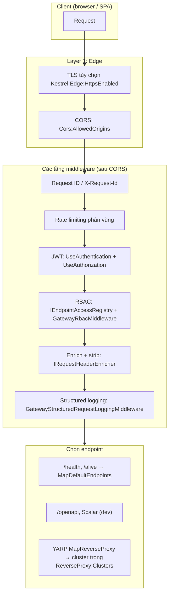

# Luồng xử lý request qua UrbanX API Gateway

Tài liệu mô tả cách **một HTTP request từ client** (browser / SPA) **đi qua Gateway** và tới **dịch vụ nội bộ** (Identity, Catalog, …), tương ứng code trong `src/Gateway` và tài liệu `api-gateway-design.md`.

## Sơ đồ tổng quan

- **Cấu hình chính** (`Program.cs` + `AddGatewayInfrastructure`): gọi `app.UseGatewayEdgeCors()` trước, sau đó `app.UseGatewayDownstreamPipeline()`.
- **Các tầng reverse proxy (YARP)** đăng ký qua `app.MapGatewayReverseProxy()`; **sức khỏe** ứng dụng qua `app.MapDefaultEndpoints()`.

## Thứ tự thực thi (từ trên xuống)

| Bước | Thành phần | File / ghi chú |
|------|------------|-----------------|
| 0 | (Tuỳ chọn) Cấu hình Kestrel listen HTTPS khi bật `Kestrel:Edge:HttpsEnabled` | `KestrelEdgeTlsConfiguration` — chứng chỉ tải bằng `X509CertificateLoader` |
| 1 | CORS | `AddUrbanXEdgeCors` + `app.UseCors(EdgeCorsPolicyNames.Default)` trước mọi middleware còn lại |
| 2 | Gán `X-Request-Id` nếu chưa có (correlation) | `GatewayRequestCorrelationMiddleware` |
| 3 | Giới hạn tần suất | `AddGatewayRateLimiting` + `UseRateLimiter` — sliding window theo bối cảnh (IP, user, v.v.) trên bộ giới hạn tích hợp, **chưa** dùng Redis như tài liệu thiết kế từ chối ưu |
| 4 | Xác thực JWT | `AddGatewayAuthentication` — `JwtBearer`, authority/audience từ cấu hình; sự kiện `OnChallenge` trả về body JSON theo hợp đồng lỗi; cookie `access_token` được đọc trong `OnMessageReceived` |
| 4b | Ủy quyền theo framework | `AddAuthorization` + `UseAuthorization` (để tương thích `[Authorize]` trên tài nguyên, RBAC tùy biến vẫn chạy sau) |
| 5 | RBAC thô | `GatewayRbacMiddleware` dùng `IEndpointAccessRegistry` (`EndpointAccessRegistry`) từ `GatewayRbac` (public, permission, `FallThroughToAuthenticatedOnly`) |
| 6 | Biến đổi request | `GatewayRequestEnrichmentMiddleware` → `IRequestHeaderEnricher` (`RequestHeaderEnricher`): bỏ `Authorization` / `Cookie`, bổ sung `X-User-Id`, `X-User-Roles`, `X-Merchant-Id` (khi có), `X-Permission-Scope` (khi đã thiết lập trong bước 5) |
| 7 | Ghi log có cấu trúc (sau khi context đủ) | `GatewayStructuredRequestLoggingMiddleware` |
| 8 | Định tuyến endpoint | Trùng `/health` / `/alive` thì trả bởi health checks; ngược lại, YARP ánh xạ tới `ReverseProxy:Routes` và forward tới địa chỉ trong `Clusters` |

Khi bị từ chối ở rate limit, RBAC hoặc cùng tài nguyên lỗi, **GatewayErrorResponseWriter** (và 429) trả về `request_id`, `timestamp`, `error`, `message` theo `api-gateway-design` §11; 429 còn có `retry_after` (và header `Retry-After` nếu có cấu hình từ lease).

## Đường đi tới “internal service” (downstream)

1. Client gửi tới **host của Gateway** (cổng đã cấu hình cho `UrbanX.Gateway`).
2. Headers nhạy cảm từ client tới dịch vụ **bị bỏ**; Gateway **ghi đè** (hoặc tạo) `X-User-Id` và các `X-*` từ claims sau khi đã xác thực (khi cần).
3. YARP tạo request HTTP tới `Clusters:*:Destinations:*:Address` (ví dụ `http://localhost:5290` cho catalog) — **cùng path gần** như phía client (nếu không cấu hình transform thêm), vì cấu hình hiện tại không rewrite path theo tên service khác với design doc.
4. Dịch vụ downstream nên coi `X-User-Id` / `X-Permission-Scope` **đáng tin từ Gateway** (chỉ tới qua mạng nội bộ, không từ Internet trực tiếp nếu có zero trust ở lớp mạng).

**OpenTelemetry**: `AddServiceDefaults` bật trace/metrics; span ASP.NET Core cho request Gateway; gọi tới upstream qua YARP có thể được tách span con nếu máy thu cấu hình đúng. Không cần client gắn `traceparent` — ASP.NET tạo ngữ cảnh khi cần.

## Public vs protected: mặc định khi không cấu hình `GatewayRbac:Public`

Khi mảng `Public` rỗng, `GatewayRbacOptionsSetup` tự bổ sung tuyến mẫu (kể cả `/api/v1/catalog` GET, OIDC `/connect/*` cần thiết, `POST /api/account/register`, health/`.well-known`). Sửa `GatewayRbac` trong `appsettings` để cập nhật. `FallThroughToAuthenticatedOnly: true` nghĩa là: **không** nằm public và **không** trùng rule nào → cần **bất kỳ** JWT hợp lệ (không kiểm permission cụ thể).

## Điểm khác tài liệu thiết kế nên biết (cải thiện tương lai)

| Tài liệu | Hiện trạng mã |
|---------|----------------|
| Giới hạn tần suất theo nhiều bộ, Redis, sliding ở edge | Một bộ toàn cục tích hợp với phân vùng (IP, user, auth, search, write) — ổn cho dev/giới hạn demo |
| Header tốc độ: `X-RateLimit-Limit/Remaining/Reset` | 429 trả lỗi theo hợp đồng; header tốc độ từ server giới hạn tần suất tích hợp cần bổ sung nếu muốn 1-1 tài liệu |
| Health tổng hợp tất cả dịch vụ | `MapDefaultEndpoints` chỉ kiểm tra **bản thân** Gateway; gọi từng dịch vụ là phần mở rộng |
| Timeout / retry / passive health YARP từng cluster | Cấu hình tối thiểu trong `appsettings.json`; có thể bổ sung theo mục 7–9 tài liệu |
| Bảng quy tắc RBAC đầy đủ từng dòng (§10) | `Rules` cấu hình để; mẫu ngắn, đủ bảo mật khi tắt tuyến public tùy thuộc cấu hình |

Cập nhật tài liệu này nếu thay đổi `UseGatewayDownstreamPipeline` hoặc `MapGatewayReverseProxy` trong `Program.cs`.
